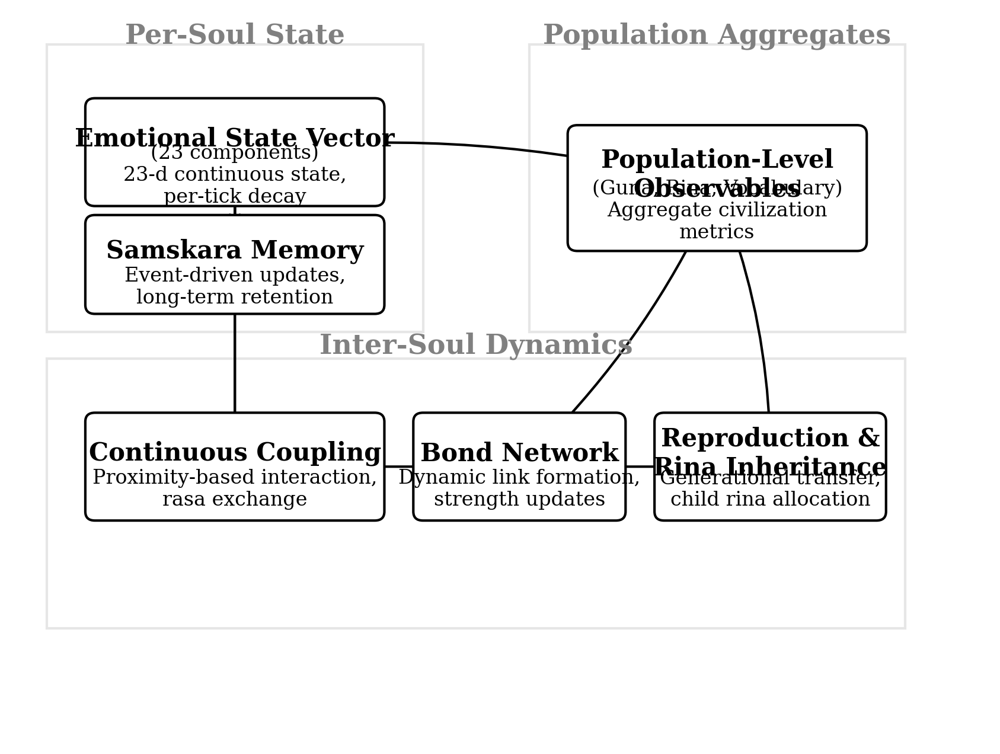

# Samskriti — emotional state engine

[](LICENSE)
[](https://en.cppreference.com/w/cpp/17)
[](tests/test_samskriti.cpp)
[](https://doi.org/10.5281/zenodo.20531430)

The reference implementation for **"Character Without Retraining: Emergent Civilizational
Psychology from Continuous Emotional State Dynamics in Non-LLM Multi-Agent Simulation"**
([paper](https://doi.org/10.5281/zenodo.20531430)).

A C++17 library that gives agents persistent emotional and relational state. No neural
network, no training, no external dependencies. Character emerges from how experience
accumulates in state over time.

---

## The idea

Most artificial characters are configured: you write a personality, and the character is
that description until you rewrite it. This engine takes the opposite approach — character
is *computed*, as the residue of what an agent has lived through.

<table>
<tr>
<td width="50%" valign="top">

### What the paper reports

Three findings, all emergent from the dynamics rather than specified:

**Bond strengths spanning orders of magnitude** — relationships differentiate on their own; nothing assigns them tiers.

**A trimodal distribution of inherited traits** — descendants cluster into three temperamental groups without any rule producing three of anything.

**Population-level shifts after loss** — grief propagates through the bond graph and moves the constitution of agents who were never directly involved.

</td>
<td width="50%" valign="top">

### Where this could be used

Anywhere a character must *stay itself* across a long interaction, and be changed by it:

**Game characters** — state per (character, player) pair is fixed-size regardless of history. An NPC remembering a betrayal from forty hours ago costs the same as one you just met.

**Social & assistive robotics** — 188 bytes per agent, no GPU, no network. It fits on the robot and survives a reboot.

**Conversational agents** — state computed outside the model; the model speaks *from* it rather than inferring it from a transcript.

**Multi-agent simulation** — bonds, grief propagation, and trait inheritance across generations, none of it scripted.

**Interactive narrative** — disposition toward the reader computed from what happened, not branched from flags.

</td>
</tr>
</table>



Figures from the paper are in [`figures/`](figures/).

The state model is drawn from classical Indian frameworks for emotional and behavioral
dynamics, mapped onto computable quantities.

### The vocabulary

Four concepts carry the model. Each names something English handles awkwardly or not at all,
so the Sanskrit is kept and the meaning explained.

**rasa** — the felt quality of an emotional state.

Not emotion as a label but emotion as a *flavour*: the texture of wonder as distinct from joy,
of grief as distinct from fear. The word means juice, or essence — what you actually taste of
a feeling. Twenty-three of them here, each with its own natural lifespan. Peace (*shanta*)
lingers a long time. Wonder (*adbhuta*) burns off fast. Aversion (*dvesha*) is among the most
persistent states a mind can hold.

**guna** — the underlying quality something is made of, in shifting proportion.

Three of them: *sattva* (clarity, lightness, balance), *rajas* (movement, drive,
restlessness), *tamas* (weight, inertia, dullness). Not virtues and vices — closer to
temperature or density. Every agent is a mixture, and the mixture decides how hard the world
lands on them. The same event striking a light agent and a heavy one produces different
states.

**samskara** — the mark an experience leaves behind.

The image is a groove worn by repetition: a riverbed, a footpath across grass. Nothing passes
through a mind without depositing something, and what it deposits shapes the course of
whatever comes after.

**vasana** — the tendency those marks harden into.

When enough similar grooves accumulate they become a disposition — something an agent leans
toward before anything has been decided. The nearest English word is *habit*, but vasana runs
deeper than a repeated act. It is closer to the shape a person has taken.

These come from a long tradition of thinking carefully about inner life: rasa from the
**Natyashastra**, a treatise on drama and aesthetics compiled around two thousand years ago;
the gunas from **Samkhya**, one of the classical schools of Indian philosophy; samskara and
vasana from Yoga and Buddhist psychology. They repay reading on their own terms.

What makes them useful for code is that they were never static categories. The tradition
describes states arising, colouring one another, fading at different rates, and — through
repetition — hardening into character. That is a dynamical system, described long before
there was notation for one.

The pipeline runs in that order: an event moves **rasa**, scaled by **guna**; the event
deposits a **samskara**; repeated samskaras consolidate into **vasana**; vasana shapes how the
next event is received. Samskara and vasana are the actual data structures, and the guna
vector is a live term in the state-update equation — the naming is not decorative.

**The central mechanism** is that event magnitude is derived from state rather than looked
up in a table:

```
delta = direction × intensity × governing_guna × (current_rasa + 0.1)
        × guna_scale × relationship_amplifier × aversion_modifier
```

A sattva-dominant agent amplifies sattva-governed rasas more than a tamas-dominant one. An
agent already carrying fear amplifies incoming fear more than a calm one. An agent bonded to
the source of an event feels it harder in both directions. Identical input, different
outcome, determined entirely by accumulated history.

## The dynamics

Emotions here are not independent sliders. The engine runs four coupled layers every tick,
which is what makes the state behave like a system rather than a scoreboard.

**Inter-rasa coupling — 18 relationships.** Sustained intensity in one rasa pulls others.
Wrath suppresses peace; peace damps both fear and wrath; compassion moderates wrath; courage
counters fear while fear suppresses courage; envy corrodes love; delusion feeds greed;
detachment damps craving. These are coefficients in a coupling matrix, not conditional rules,
so the interactions compose without anyone enumerating the combinations.

```c
{ RASA_KRODHA,    RASA_SHANTA,    -0.012f },  /* wrath suppresses peace      */
{ RASA_VEERA,     RASA_BHAYANAKA, -0.008f },  /* courage counters fear       */
{ RASA_MATSARYA,  RASA_SHRINGARA, -0.006f },  /* envy corrodes love          */
{ RASA_BHAYANAKA, RASA_UDVEGA,     0.004f },  /* sustained fear → anxiety    */
```

**Compound emergence.** Complex states are not injectable — they can only form. *Vishada*
(despair) emerges when grief, delusion, isolation, and fear stay jointly elevated past a
threshold, and is eroded by joy. *Titiksha* (endurance) forms out of sustained courage and
compassion. *Vairagya* (detachment) forms from peace after surviving despair. Nothing can
hand an agent despair directly; it has to be lived into.

**Per-rasa decay — 23 half-lives.** Every rasa fades at its own rate. Peace (*shanta*, 0.003)
lingers for a very long time; wonder (*adbhuta*, 0.018) is nearly gone in a few ticks;
aversion (*dvesha*, 0.004) is among the stickiest states in the system. Temperament falls out
of these rates as much as it does from any single event.

**Constitutional drift.** The guna balance itself moves over a lifetime. Bonded presence
raises sattva; proximity to death raises tamas; prolonged isolation raises rajas or tamas
depending on what the agent already is. Sustained rasas feed back into the gunas, so the
deepest layer — the one that governs how hard *everything else* lands — is itself shaped by
accumulated experience. An agent's sensitivity at hour fifty is a product of its first
forty-nine.

That last loop is the reason character compounds instead of merely accumulating.

## Build and run

No dependencies beyond a C++17 compiler.

```bash
# tests (32 assertions across emotional dynamics, bonds, determinism, dialogue)
clang++ -std=c++17 -O2 -Iinclude tests/test_samskriti.cpp src/*.cpp -o samskriti_tests
./samskriti_tests

# minimal example: 10 souls, one attack event, watch state diverge
clang++ -std=c++17 -O2 -Iinclude examples/minimal.cpp src/*.cpp -o minimal
./minimal
```

Or with CMake:

```bash
cmake -S . -B build -DCMAKE_BUILD_TYPE=Release && cmake --build build
./build/samskriti_tests
```

## API

```c
samskriti_init(seed);                       // deterministic given a seed
int id = create_soul(samskriti_default_config());
inject_event(id, "attacked", 0.7f, source_id);
tick(dt);                                   // advance all souls
SoulState s = get_state(id);                // 23 rasas, 3 gunas, samskaras, bonds
BondInfo b = get_bond(a, b);
uint64_t h = get_world_hash();              // determinism check
```

`get_behavior_hint()` and `get_dialogue_modifiers()` expose the state as an action
suggestion and as tone/formality/emotional-color, which is how a renderer or a language
model consumes it without the state living inside the model.

## Determinism

Given a fixed seed the engine is bit-reproducible; `get_world_hash()` returns a checksum of
world state and the test suite asserts against a known value. This matters for the thesis:
the character trajectory is a computed, replayable function of its experience history, not a
sample from a distribution.

## What's in this repo

- **`src/` + `include/`** — the engine: 23-rasa state, triguna sensitivity, coupling,
  compound emergence, samskara/vasana formation, bonds, and world stepping. ~2,400 lines,
  C++17, no dependencies.
- **`tests/`** — 32 assertions covering emotional dynamics, bond formation, determinism, and
  dialogue modifiers, plus a performance benchmark.
- **`examples/minimal.cpp`** — ten souls, one event, watch state diverge.
- **`figures/`** — the published figures from the paper.

The engine runs standalone. The Godot environment, world rendering, and chronicle generation
used to produce the paper's runs live separately.

## Citation

```bibtex
@misc{patel2026samskriti,
  title  = {Character Without Retraining: Emergent Civilizational Psychology from
            Continuous Emotional State Dynamics in Non-LLM Multi-Agent Simulation},
  author = {Patel, Tarang},
  year   = {2026},
  doi    = {10.5281/zenodo.20531430},
  note   = {Independent research}
}
```

## License

MIT — see [LICENSE](LICENSE). The paper is CC-BY-4.0.
